# P3 Projektna naloga: CI/CD z Docker Hub in GitHub Actions

## Docker Hub container registry

### Ustvarjanje racuna in repozitorija

Za uporabo Docker Hub smo najprej ustvarili uporabniški račun in znotraj njega dva repozitorija za shranjevanje slik: `sos-navigator-frontend` in `sos-navigator-backend`.

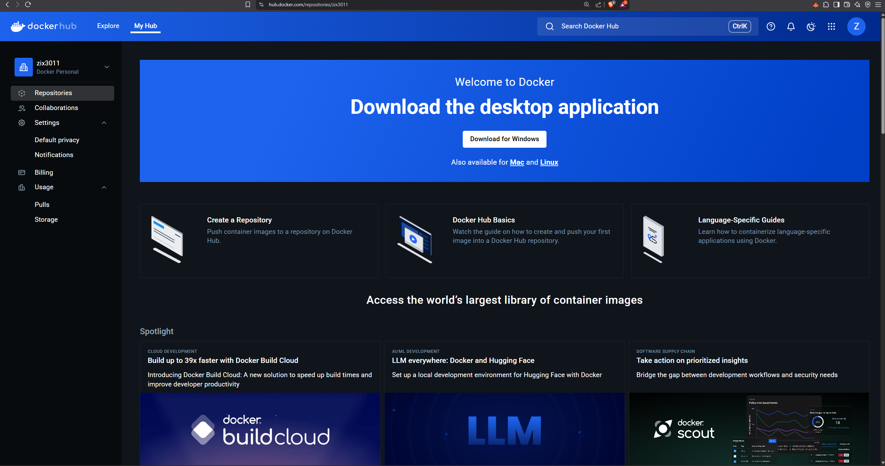

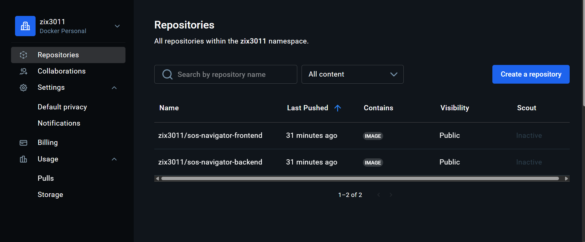


### Uporabljeni ukazi

Za upravljanje z Docker registry smo uporabljali naslednje ukaze:

```bash
docker login
docker build -t zix3011/sos-navigator-frontend:latest ./frontend
docker build -t zix3011/sos-navigator-backend:latest ./backend
docker push zix3011/sos-navigator-frontend:latest
docker push zix3011/sos-navigator-backend:latest
```

`docker login`
- Ta ukaz omogoča prijavo v Docker Hub (ali drugo Docker registrsko storitev). Ob uspešni prijavi lahko nalagate (push) ali prenašate (pull) slike, ki so povezane z vašim uporabniškim računom.

`docker build -t zix3011/sos-navigator-frontend:latest ./frontend`
- Ta ukaz zgradi Docker sliko iz Dockerfile znotraj mape ./frontend. Z zastavico -t dodelimo oznako (tag) sliki, v tem primeru:

    - zix3011/sos-navigator-frontend: ime slike v Docker Hubu (uporabniško ime + ime repozitorija)

    - :latest: oznaka verzije (oznaka latest pomeni najnovejša verzija)

`docker push zix3011/sos-navigator-frontend:latest`
- Ukaz naloži prej zgrajeno sliko v vaš Docker Hub repozitorij. Docker jo identificira po imenu in oznaki, zato mora biti ime ustrezno označeno že pri build ukazu.


### Generiranje Docker token za Github Secrets
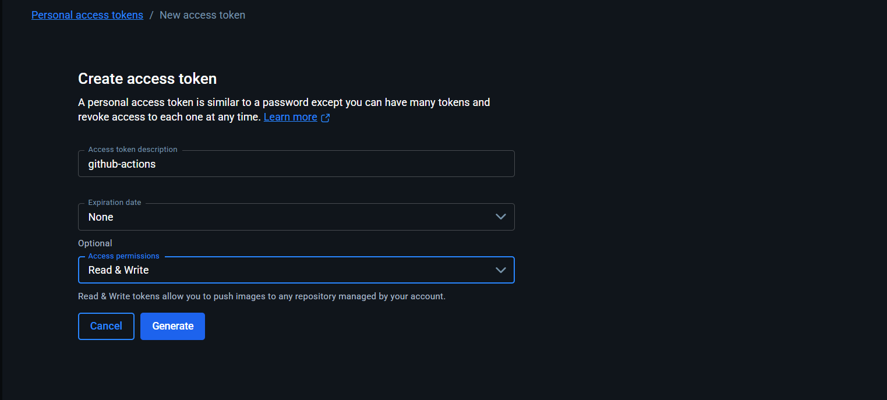

### Naložene slike

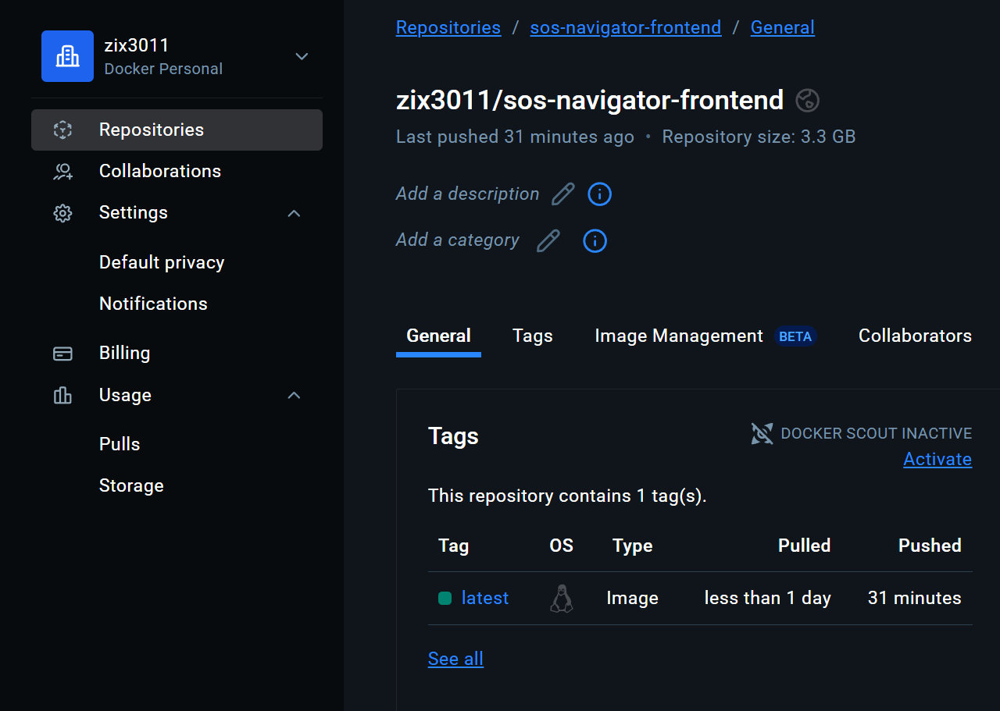
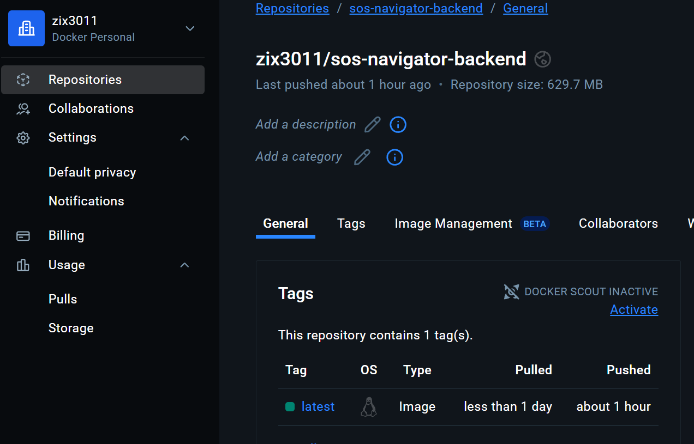


## GitHub Actions workflows

### Osnovni CI/CD Workflow

#### Opis CI/CD Pipeline workflowa
Ta GitHub Actions workflow poskrbi za celoten CI/CD postopek ob vsaki spremembi na veji develop:

Aktivacija
```yaml
on:
  push:
    branches:
      - develop
```
Workflow se sproži, ko se naredi push na vejo develop.

- Job build-and-push
Checkout kode: prenese aktualno stanje repozitorija.

- Prijava v Docker Hub: uporabi se docker/login-action z uporabo GitHub Secrets.

- Gradnja slik: za backend in frontend se zgradita Docker sliki iz pripadajočih map.

- Nalaganje slik na Docker Hub: slike se potisnejo (push) v Docker repozitorij.

- Job notify-server:
Zažene se samo, če je build-and-push uspešen.

Sproži webhook na Azure strežniku, kar nato sproži docker-compose restart z novo verzijo.
```yaml
name: CI/CD Pipeline

on:
  push:
    branches:
      - develop

jobs:
  build-and-push:
    runs-on: ubuntu-latest
    steps:
      - name: Checkout code
        uses: actions/checkout@v3

      - name: Log in to Docker Hub
        uses: docker/login-action@v1
        with:
          username: ${{ secrets.DOCKERHUB_USERNAME }}
          password: ${{ secrets.DOCKERHUB_TOKEN }}

      - name: Build Docker image BACKEND
        run: docker build -t ${{ secrets.DOCKERHUB_USERNAME }}/sos-navigator-backend:latest ./backend

      - name: Build Docker image FRONTEND
        run: docker build -t ${{ secrets.DOCKERHUB_USERNAME }}/sos-navigator-frontend:latest ./frontend

      - name: Push Docker image BACKEND
        run: docker push ${{ secrets.DOCKERHUB_USERNAME }}/sos-navigator-backend:latest

      - name: Push Docker image FRONTEND
        run: docker push ${{ secrets.DOCKERHUB_USERNAME }}/sos-navigator-frontend:latest

  notify-server:
    needs: build-and-push
    runs-on: ubuntu-latest
    if: success()
    steps:
      - name: Trigger Webhook on Azure VM
        uses: distributhor/workflow-webhook@v3
        with:
            webhook_url: ${{ secrets.WEBHOOK_URL }}
            webhook_secret: ${{ secrets.WEBHOOK_SECRET }}
            webhook_type: 'json'
```

### Dodatni Workflow za preverjanje commit sporočil
Ta workflow preverja ustreznost oblik commit sporočil, da sledijo dogovorjenemu SCRUM formatu.

Aktivacija:
```yaml
on:
  push:
    branches:
      - main
      - develop
```
Job check-commit-message preveri, ali vsa commit sporočila ustrezajo regex izrazu:

`^SCRUM-[0-9]+ .+`
- Če sporočilo ni v formatu `SCRUM-<številka> <besedilo>`, se build prekine z napako.
```yaml
name: Check Commit Message Format

on:
  push:
    branches:
      - main
      - develop

jobs:
  check-commit-message:
    runs-on: ubuntu-latest
    steps:
      - name: Check commit message starts with SCRUM-
        uses: gsactions/commit-message-checker@v2
        with:
          pattern: '^SCRUM-[0-9]+ .+'
          error: 'Commit message must be in format: SCRUM-<number> <message>'
          excludeDescription: 'true'
          checkAllCommitMessages: 'true'
```


### Dodatni Workflows, ki bi jih lahko dodali

Za nadaljnjo avtomatizacijo in izboljšanje kakovosti kode bi lahko dodali naslednje dodatne GitHub Actions workflows:

* **Preverjanje kode s statičnimi analizatorji** (npr. ESLint za frontend, `flake8` za Python backend), da bi zgodaj odkrili napake v slogu ali potencialne napake v kodi.
* **Security scanning**: z uporabo orodij kot so `Snyk` ali `Trivy`, da bi preverili Docker slike in pakete za znane varnostne ranljivosti.
* **Automatska generacija dokumentacije**: z uporabo orodij kot `Swagger` za API dokumentacijo ali `JSDoc`/`KDoc` za frontend/backend.

Vsi ti workflowi bi bili postavljeni v `.github/workflows/` mapi z ločenimi `.yml` datotekami, vsak z različnimi "triggerji" (`on: push`, `on: pull_request`, `schedule` ipd.).

### Uporaba GitHub Secrets

Uporabili smo secrets za varno hranjenje poverilnic:

* `DOCKERHUB_USERNAME`
* `DOCKERHUB_TOKEN`
* `WEBHOOK_URL`
* `WEBHOOK_SECRET`

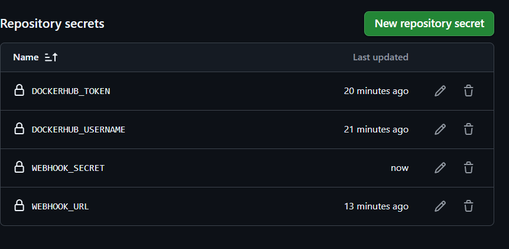

## Webhook

### `docker-compose.yml` datoteka

```yaml
services:

  frontend:
    image: zix3011/sos-navigator-frontend:latest
    restart: always
    ports:
      - "3000:3000"
    volumes:
      - ./frontend:/app
      - /app/node_modules

  backend:
    image: zix3011/sos-navigator-backend:latest
    restart: always
    ports:
      - "3002:3002"
    volumes:
      - ./backend:/app
      - /app/node_modules
      - /home/projektUser/deploy.sh:/deploy.sh:ro
    extra_hosts:
    - "host.docker.internal:host-gateway"
```

### Bash skripta za ponovno zaganjanje
- Skripta katera pridobi najnovejšo verzijo kode iz Docker Hub-a, zbriše stare verzije in ponovno zgradi rešitev

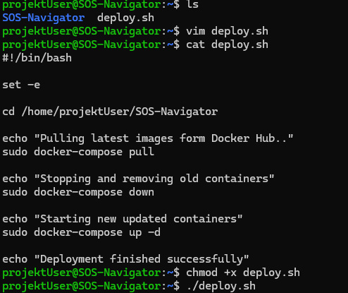

### Python Webhook strežnik

Preprost Python strežnik, ki ob prejemu POST zahteve najprej preveri ujemanje WEBHOOK_SECRET in zažene prej omenjeno skripto, če ujemanje ni se pošljejo ustrezne odgovore.

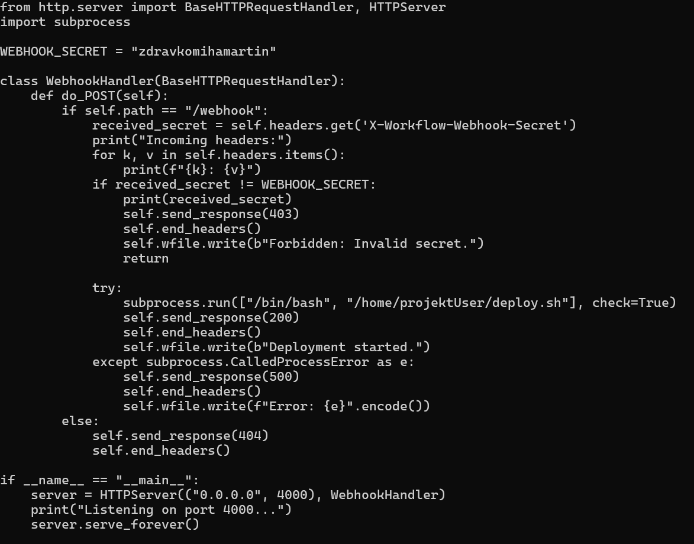

### Preverjanje delovanja

* Log datoteka `output.log`
    - Poročilo po izvajanju skripte.
  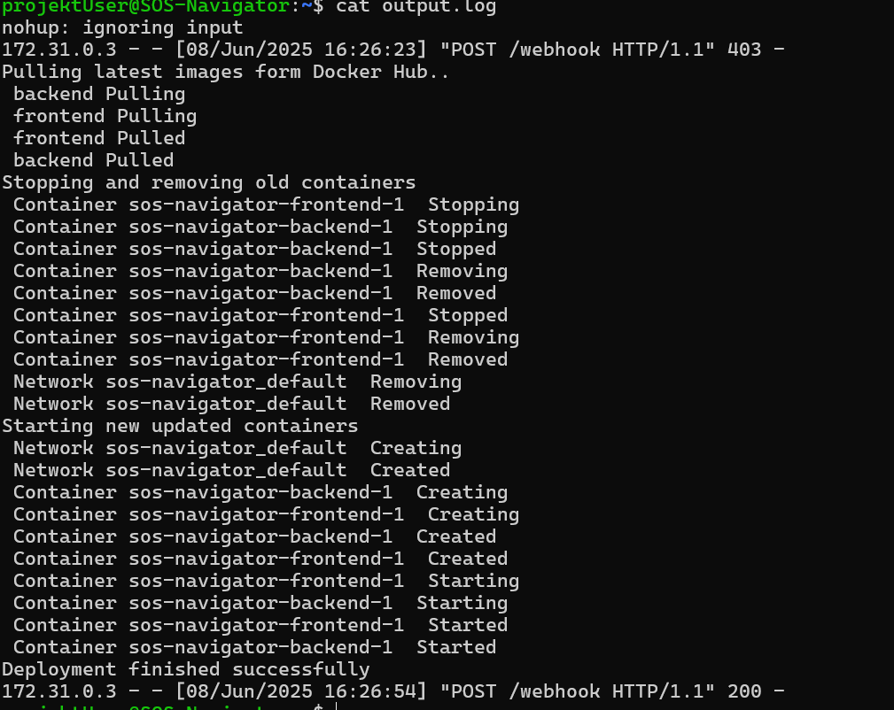
* Preverjanje s Postman

  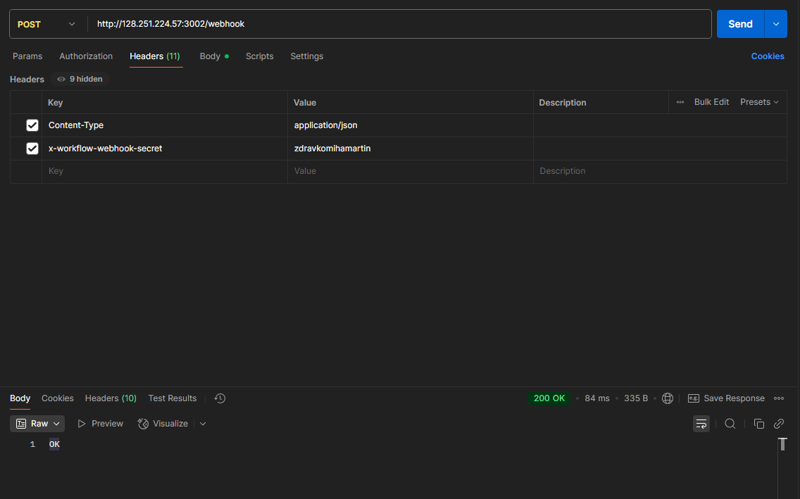
* Preverjanje na GitHub

  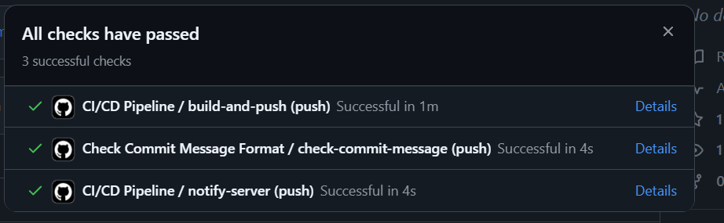


## Težave katere smo jih meli
1. Težave smo imeli na začetku pri proženju webhookov, ker docker container sam po sebi nima dostop do basha. Naša prva rešitev je bila da bi direktno poklicali našo skripto `./deploy.sh` z komando `exec()` (v javaScript-u) kar se je iskazalo nemogoče. Potem smo na virtualnem stroju ustvarili preprost Python strežnik ki posluša na vrata 4000 za sporočilo /webhook ki ga sproži naš API.


## Varnostni pomisleki pri uporabi Webhook

Webhook lahko predstavlja varnostno tveganje, saj zunanji uporabniki lahko pošiljajo lažne zahteve. Zato:

* uporabljamo `WEBHOOK_SECRET` za preverjanje pristnosti zahteve,
* zahteva mora biti podpisana in preverjena v Python strežniku,

* dostop je možen samo znotraj zaprtega omrežja Azure.
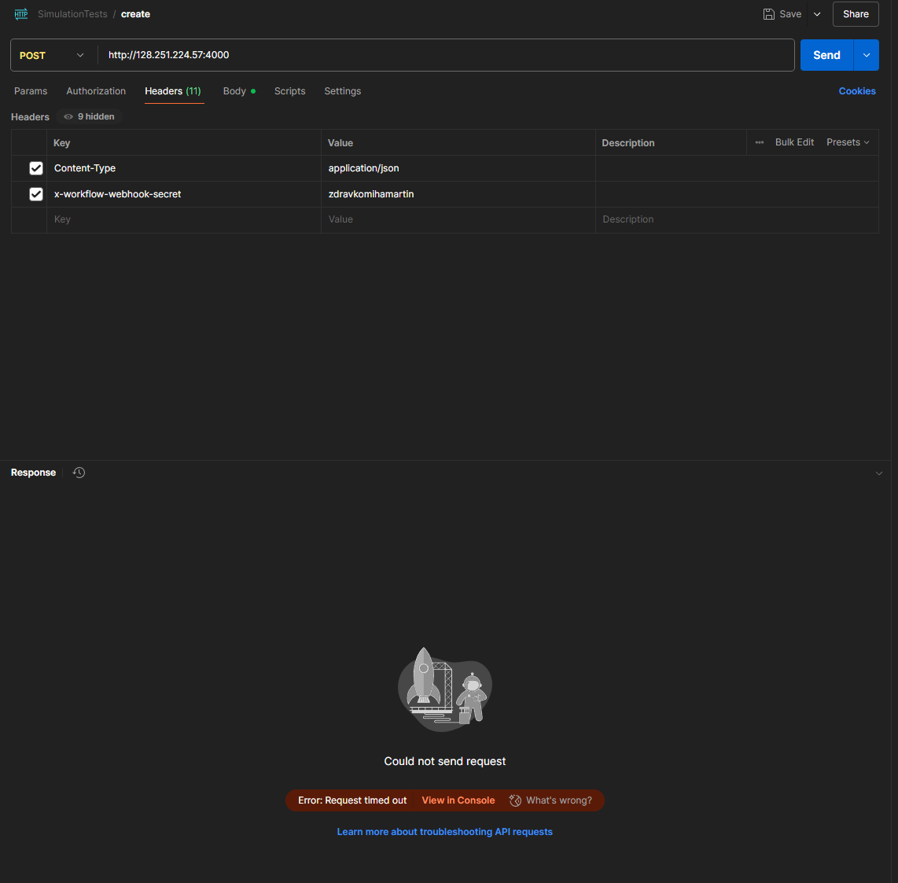

## Projektno vodenje

Sprint smo vodili v Jiri in beležili naloge posameznih članov ekipe.

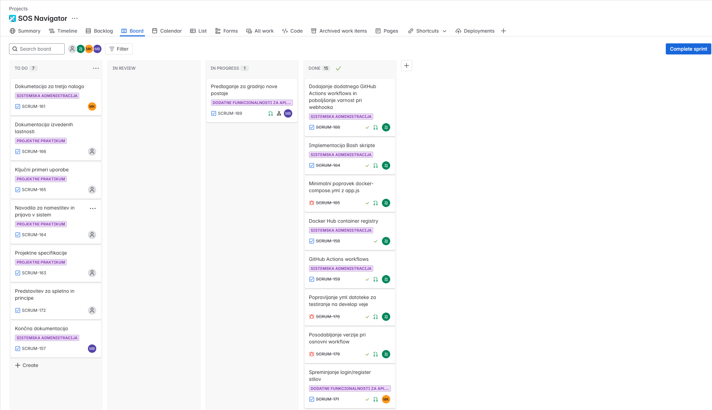


